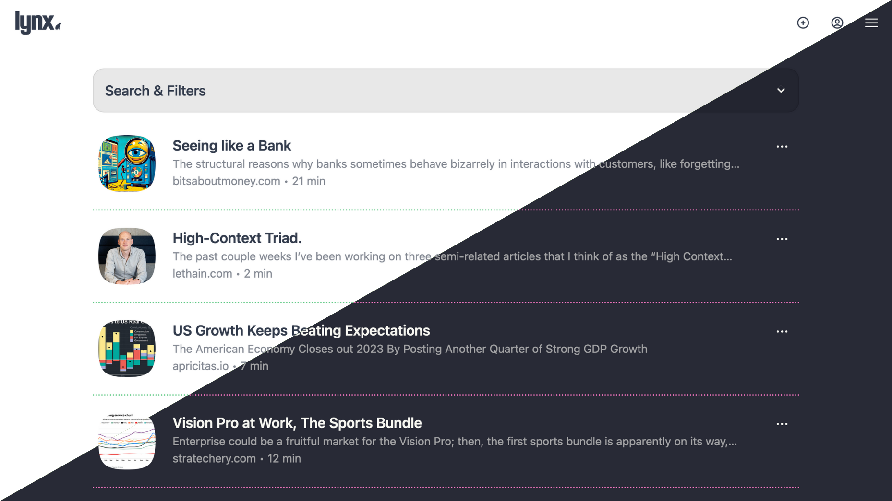
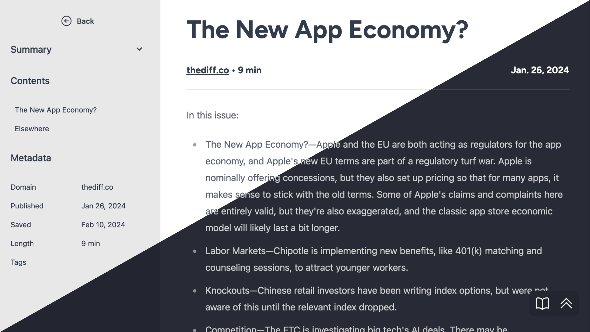

  <picture>
    <source media="(prefers-color-scheme: dark)" srcset="resources/logo_full_light.svg" width="40%">
    <source media="(prefers-color-scheme: light)" srcset="resources/logo_full_dark.svg" width="40%">
    
  </picture>

Lynx is a self-hostable read-it-later service that let's you save articles or passages in the moment and get back to reading them later (eventually). Never worry about losing access to articles due to link rot, as all article content is parsed and saved locally.

Better yet, Lynx contains _zero JavaScript_* so it can run on just about anything!

(* Well, there are small snippets [here](https://github.com/brendanv/lynx/blob/c35c61517a5bd225805740837ee2fc4b7910842a/lynx/templates/lynx/link_viewer.html#L124-L132) and [here](lynx/templates/lynx/add_link.html#L18-L24) that are required to allow you to save highlights in your notes.. but Lynx also works great with JavaScript completely disabled.)

<picture>
  
</picture>

# Features

- Save links quickly and easily, using the web UI or via a single API call.
- View saved articles in a clean, easily-readable format.
  - Plus, an optional integration with [SingleFile](https://github.com/gildas-lormeau/SingleFile) to save faithful standalone archives of the complete webpage. Build your own internet archive!
- Save highlighted passages from any articles in your collection or from around the web.
- Subscribe to RSS feeds to automatically download and save new articles as they're posted.
- Full text search and tagging support let's you quickly find anything in your saved articles.
- Bring your own API key and automatically summarize all articles using the latest LLM hotness.
- Self-hostable via Docker, for ultimate privacy.
  - Plus, multi-user support so friends and family can save their own links.
- Light- and dark-mode support out of the box.

<picture>
  
</picture>

# Installation

The primary supported installation method is via Docker. To get up and running quickly:

- Download a copy of [docker-compose.yml](resources/docker/docker-compose.yml) and [docker-compose.env](resources/docker/docker-compose.env) from this repository
- Fill out the placeholder values in both files for your specific server setup
- Run docker compose with the compose file and you should be able to access lynx at `your-server.com:8000`

Note that Lynx utilizes a very basic system for processing background tasks that requires a background job to be run on a cron schedule. The docker image above uses [Ofelia](https://github.com/mcuadros/ofelia) but you're free to use something else if you'd prefer.

# Usage

After installation, you can start saving links to your Lynx instance. Use the web interface to add, manage, and read your saved links.

> [!NOTE]
> There is currently no user management built in to Lynx. In order to add or remove users, or change passwords, you will need to access the Django control panel at `your-server.com:8000/admin`. The user created via your docker compose file will be a superuser that has access to the control panel.

## Using the API 

Lynx supports a very simple API for adding new links or notes to your collection. When Lynx is running, you can access documentation about the API endpoints at `your-server.com:8000/api/docs`.

In order to perform actions via the API you are required to have an API key. The API key can be generated within Lynx via your user settings page. This API key can be provided in your API requests either:

- via an `X-API-Key` header, or
- via the `Authentication` header with type `Bearer`

In general, there are two API endpoints:

- `your-server.com:8000/api/links/add`
- `your-server.com:8000/api/notes/add`

They both require a `url` parameter and the notes endpoint also requires the note `content` to be provided. That's it! 

## SingleFile integration
If you enabled the singlefile container and environment variable in your docker-compose and env files, then Lynx will attempt to create a standalone archive of all the pages you save. Any cookies that you have saved within Lynx will also be passed along when archiving, so if you're able to load the page in Lynx then it should also archive correctly.

This process is not perfect and depending on your setup can be slow (it sends an HTTP request to the [lynx-singlefile container](https://github.com/brendanv/lynx-singlefile), which runs headless Chrome to load the page and process everything into a single file) but it works pretty well. 

## Contributing

Contributions are welcome but no guarantees that it will be accepted - I mostly built Lynx for myself so I'm somewhat opinionated on how it should evolve :)

## License

Lynx is released under the MIT License. See the `LICENSE` file for more details.